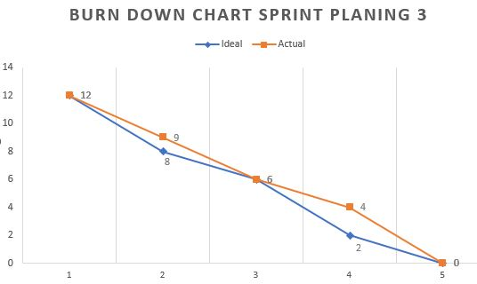

# Implementasi Sistem Informasi Manajemen Kantor Menggunakan Scrum Framework di Desa Wangunsari

## Burndown Chart

### Gambar 3. Detail Burndown Chart Sprint Planning 1

Pada Gambar 3. Burndown Chart Sprint Planning 1 diperoleh 45 task diselesaikan oleh 3 orang 
dalam selang waktu 5 hari. Pada sprint planning 1 ini, aktivitas sempat terlambat sedikit 
di hari ke 2 dan berhasil mengembalikan ke posisi awal di akhir sprint 1. 

### Gambar B. Detail Burndown Chart Sprint Planning 2

Gambar burndown chart diatas menunjukan 31 task dalam 1 sprint. pada hari ke 1 ideal lebih baik dari
pada aktual akan tetapi di hari ke 2 mengalami perubahan. Di hari ke 3 jarak pengerjaan task lebih 
lebar sampai dengan hari ke 4. pada hari ke 5 di akhir sprint, burndown chart menunjukan keterlambatan
sebesar 3 task yang belum selesai pada akhir sprint 2. 

### Gambar C. Detail Burndown Chart Sprint Planning 3

Gambar burndown chart diatas menunjukan 15 task dari rencana awal, akan tetapi karena ada 3 task yang
belum selesai di sprint planning 2, maka di masukan pada sprint planning 3. update backlog menjadi 18
task. Dari chart di atas dapat dilihat percepatan sampai pada titik normal di hari ke 3 akan tetapi
hari ke 4 mengalami perlambatan dan di hari ke 5 kembali menyelesaikan task dengan tepat waktu.

### Gambar D. Detail Burndown Chart Sprint Planning 4
 

Gambar diatas menampilkan tim sudah mulai terbiasa dengan sistem kerja scrum yang ditunjukan
dari awal pengerjaan yang di bawah rencana akan tetapi di hari ke 3 sudah mulai mengejar 
ketinggalan sampai selesai sesuai dengan perencanaan yang ada.

### Gambar E. Detail Burndown Chart Sprint Planning 5
 

Burndown chart pada sprint planning 5 hanya menyelesaikan 4 task yang tersisa. tim pengerja 
berhasil selesai tepat waktu dengan membagi 2 task setiap hari. di hari ke 3 semua task sudah
berhasil diselesaikan sesuai dengan rencana.