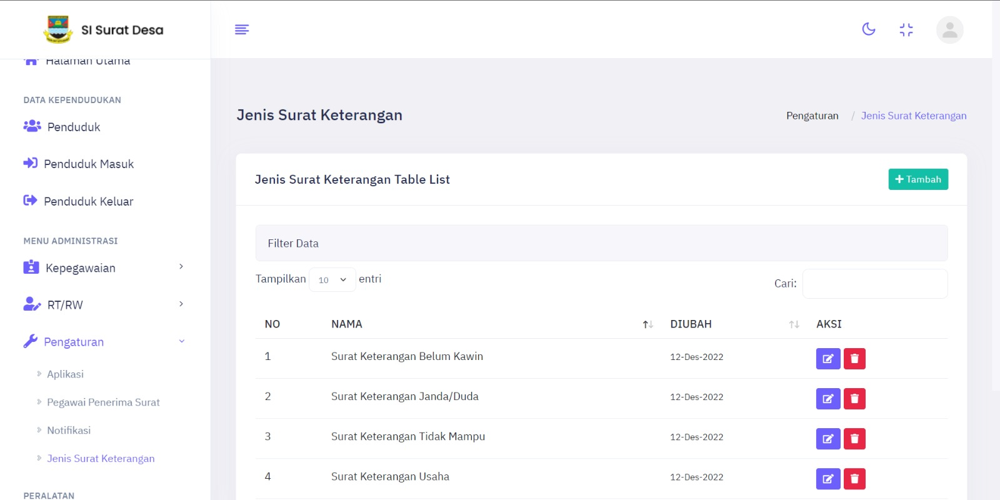
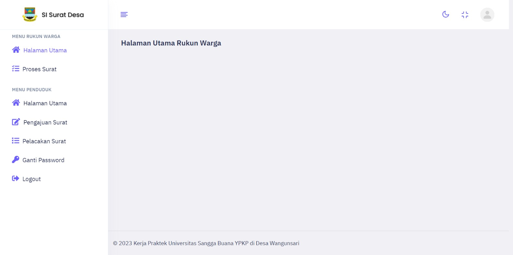
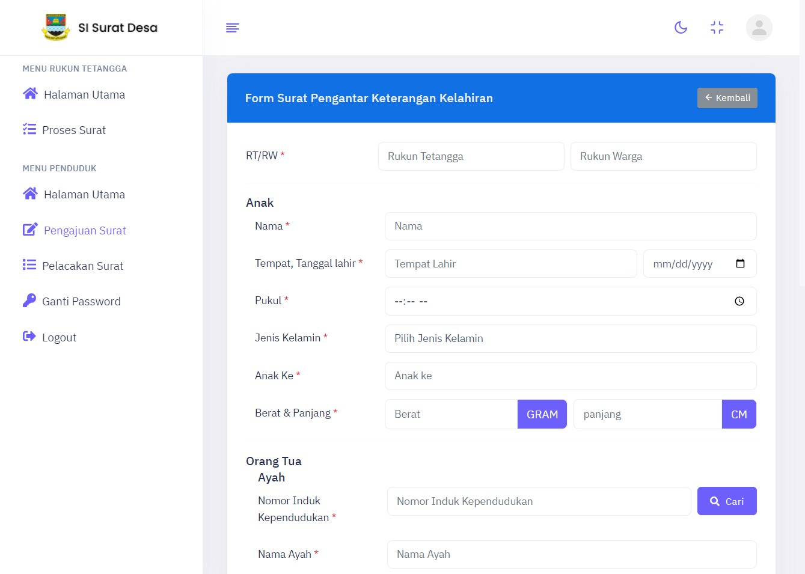
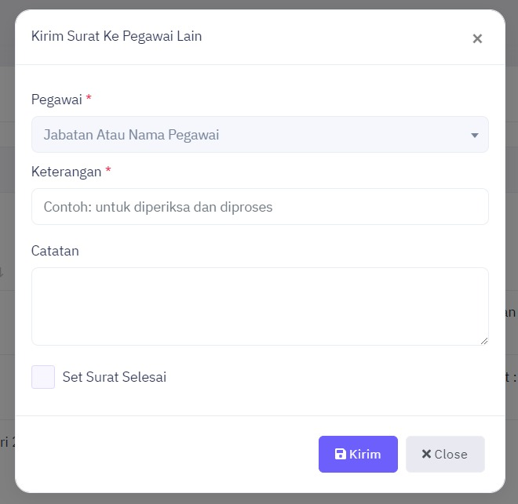

# Implementasi Sistem Informasi Manajemen Kantor Menggunakan Scrum Framework di Desa Wangunsari

## Sprint Review

### Gambar 1. backlog 1 : Halaman Login

### Gambar 2. backlog 2 : Halaman Utama - Administrator

### Gambar 3. backlog 3 : Kelola Data Penduduk - Administrator

### Gambar 4. backlog 4 : Kelola Data Jabatan Pegawai - Administrator

### Gambar 5. backlog 5 : Kelola Data Pegawai - Administrator

### Gambar 6. backlog 6 : Kelola Data Rukun Tetangga - Administrator

### Gambar 7. backlog 7 : Kelola Data Rukun Warga - Administrator

### Gambar 8. backlog 8 : Pengaturan Aplikasi - Administrator

### Gambar 9. backlog 9 : Pengaturan Pegawai Penerima Surat - Administrator

### Gambar 10. backlog 10 : Pengaturan Jenis Surat Keterangan - Administrator

### Gambar 11. backlog 11 : Manajemen Pengguna - Administrator

### Gambar 12. backlog 12 : Ganti Password

### Gambar 13. backlog 13 : Ganti Password

### Gambar 14. backlog 14 : Halaman Utama - Rukun Warga

### Gambar 15. backlog 15 : Halaman Utama - Pihak Desa

### Gambar 16. backlog 16 : Halaman Pengajuan Surat - Penduduk

### Gambar 17. backlog 17 : Halaman Formulir Pengajuan Surat - Penduduk

### Gambar 18. backlog 18 : Simpan Pengajuan Surat - Penduduk

### Gambar 19. backlog 19 : Halaman Pelacakan Surat - Penduduk

### Gambar 20. backlog 20 : Pembatalan Surat - Penduduk

### Gambar 21. backlog 21 : Halaman Pelacakan Suarat Detail - Penduduk

### Gambar 22. backlog 22 : Cetak surat ke PDF - Penduduk

### Gambar 23. backlog 23 : Halaman Proses Surat - Rukun Tetangga

### Gambar 24. backlog 24 : Setujui Pengajuan Surat - Rukun Tetangga

### Gambar 25. backlog 25 : Tolak Pengajuan Surat - Rukun Tetangga

### Gambar 26. backlog 26 : Halaman Proses Surat - Rukun Warga

### Gambar 27. backlog 27 : Setujui Pengajuan Surat - Rukun Warga

### Gambar 28. backlog 28 : Tolak Pengajuan Surat - Rukun Warga

### Gambar 29. backlog 29 : Halaman Proses Surat - Pihak Desa

### Gambar 30. backlog 30 : Kirim Surat Ke Pegawai Lain - Pihak Desa

### Gambar 31. backlog 31 : Set Nomor Surat - Pihak Desa

### Gambar 32. backlog 32 : Set Selesai - Pihak Desa

### Gambar 33. backlog 33 : Serahkan Surat Ke Penduduk - Pihak Desa

